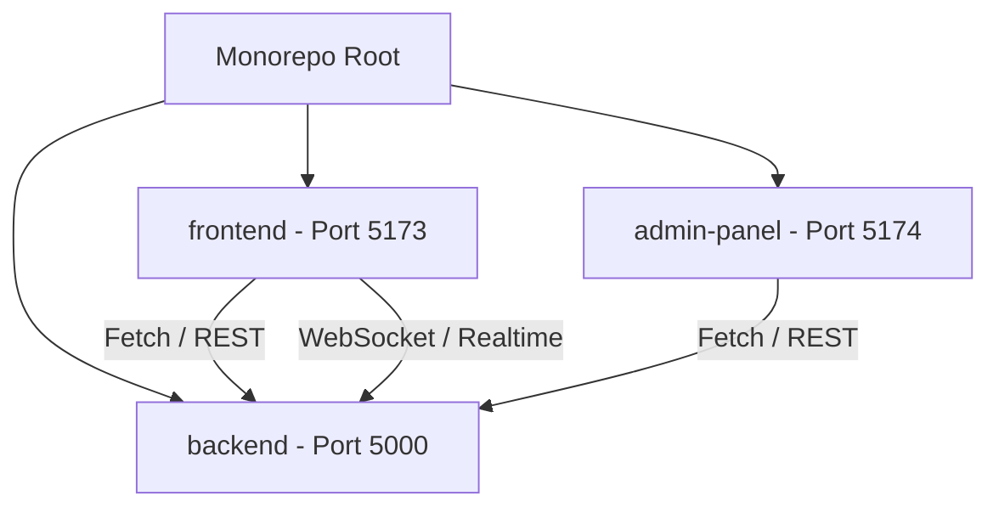

# Technical Requirements & Design Document (TRD)

## 1. System Architecture
Campus Connect is designed as a modular Monorepo with three core workspaces coordinated via NPM Workspaces:

---

## 2. Technology Stack
*   **Main Frontend (`/frontend`)**:
    *   Framework: React + Vite + TypeScript.
    *   Router: `@tanstack/react-router` (Static Client-Side SPA Mode).
    *   State Management: `@tanstack/react-query` (Data caching & mutations).
    *   Styling: Tailwind CSS + Vanilla CSS variables.
*   **Admin Dashboard (`/admin-panel`)**:
    *   Framework: React + Vite + TS.
    *   Router: `react-router-dom`.
    *   HTTP Client: Axios.
*   **Backend Services (`/backend`)**:
    *   Runtime: Node.js + Express.js.
    *   Database: MongoDB + Mongoose.
    *   Real-time Sockets: Socket.io.
    *   Storage Integration: Google Drive API (v3) + Cloudinary API.

---

## 3. Database Schema Models
*   **User Schema**: Stores authentication credentials, active verification state (`pending`, `approved`, `rejected`), rejection reasons, skills, academic branch, and Google OAuth flags.
*   **Resource Schema**: Indexes uploaded academic materials. Stores Drive URLs, Drive file IDs, semantic details (Subject, branch, sem, unit), and owner references.
*   **Mentorship Request Schema**: Maps connection links between juniors and seniors, containing statuses (`pending`, `accepted`, `rejected`) and connection timestamps.
*   **Message Schema**: Captures private chat histories, indexing sender, receiver, dynamic typing status, and read statuses.

---

## 4. Key Security Designs
*   **JSON Web Tokens (JWT)**: Passed as Bearer tokens in headers. Exposes a `protect` middleware to shield private routes, extracting user state.
*   **Senior Authorization Rules (`seniorOrAdmin`)**: Rejects any user whose academic year is below 2, preventing Juniors from performing critical resource edits.
*   **Admin Authorization Rules (`admin`)**: Restricts admin-only controls to validated admin role profiles.
